# UML Diagrams
## Labyrinth of the Dragon - System Architecture

---

## Class Diagrams

### Core Game Entities

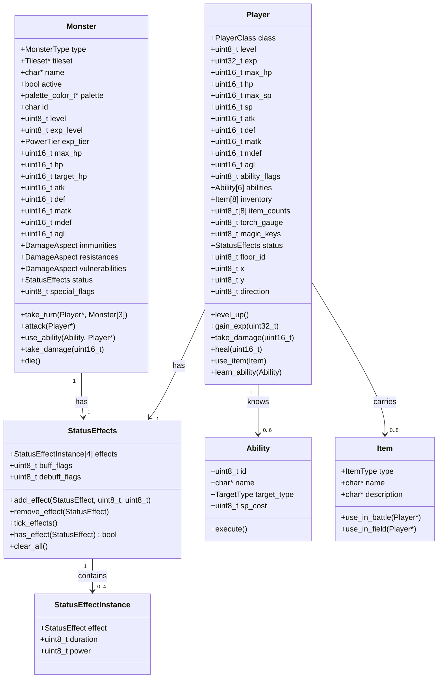
```mermaid
classDiagram
    class Player {
        +PlayerClass class
        +uint8_t level
        +uint32_t exp
        +uint16_t max_hp
        +uint16_t hp
        +uint16_t max_sp
        +uint16_t sp
        +uint16_t atk
        +uint16_t def
        +uint16_t matk
        +uint16_t mdef
        +uint16_t agl
        +uint8_t ability_flags
        +Ability[6] abilities
        +Item[8] inventory
        +uint8_t[8] item_counts
        +uint8_t torch_gauge
        +uint8_t magic_keys
        +StatusEffects status
        +uint8_t floor_id
        +uint8_t x
        +uint8_t y
        +uint8_t direction
        +level_up()
        +gain_exp(uint32_t)
        +take_damage(uint16_t)
        +heal(uint16_t)
        +use_item(Item)
        +learn_ability(Ability)
    }

    class Monster {
        +MonsterType type
        +Tileset* tileset
        +char* name
        +bool active
        +palette_color_t* palette
        +char id
        +uint8_t level
        +uint8_t exp_level
        +PowerTier exp_tier
        +uint16_t max_hp
        +uint16_t hp
        +uint16_t target_hp
        +uint16_t atk
        +uint16_t def
        +uint16_t matk
        +uint16_t mdef
        +uint16_t agl
        +DamageAspect immunities
        +DamageAspect resistances
        +DamageAspect vulnerabilities
        +StatusEffects status
        +uint8_t special_flags
        +take_turn(Player*, Monster[3])
        +attack(Player*)
        +use_ability(Ability, Player*)
        +take_damage(uint16_t)
        +die()
    }

    class StatusEffects {
        +StatusEffectInstance[4] effects
        +uint8_t buff_flags
        +uint8_t debuff_flags
        +add_effect(StatusEffect, uint8_t, uint8_t)
        +remove_effect(StatusEffect)
        +tick_effects()
        +has_effect(StatusEffect) bool
        +clear_all()
    }

    class StatusEffectInstance {
        +StatusEffect effect
        +uint8_t duration
        +uint8_t power
    }

    class Ability {
        +uint8_t id
        +char* name
        +TargetType target_type
        +uint8_t sp_cost
        +execute()
    }

    class Item {
        +ItemType type
        +char* name
        +char* description
        +use_in_battle(Player*)
        +use_in_field(Player*)
    }

    Player "1" --> "1" StatusEffects : has
    Monster "1" --> "1" StatusEffects : has
    StatusEffects "1" --> "0..4" StatusEffectInstance : contains
    Player "1" --> "0..6" Ability : knows
    Player "1" --> "0..8" Item : carries
```

### Battle System

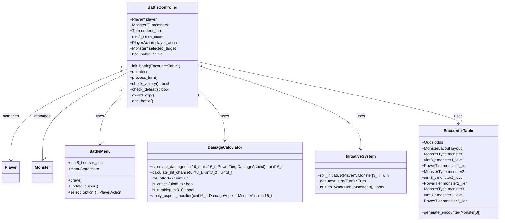
```mermaid
classDiagram
    class BattleController {
        +Player* player
        +Monster[3] monsters
        +Turn current_turn
        +uint8_t turn_count
        +PlayerAction player_action
        +Monster* selected_target
        +bool battle_active
        +init_battle(EncounterTable*)
        +update()
        +process_turn()
        +check_victory() bool
        +check_defeat() bool
        +award_exp()
        +end_battle()
    }

    class EncounterTable {
        +Odds odds
        +MonsterLayout layout
        +MonsterType monster1
        +uint8_t monster1_level
        +PowerTier monster1_tier
        +MonsterType monster2
        +uint8_t monster2_level
        +PowerTier monster2_tier
        +MonsterType monster3
        +uint8_t monster3_level
        +PowerTier monster3_tier
        +generate_encounter(Monster[3])
    }

    class BattleMenu {
        +uint8_t cursor_pos
        +MenuState state
        +draw()
        +update_cursor()
        +select_option() PlayerAction
    }

    class DamageCalculator {
        +calculate_damage(uint16_t, uint16_t, PowerTier, DamageAspect) uint16_t
        +calculate_hit_chance(uint8_t, uint8_t) uint8_t
        +roll_attack() uint8_t
        +is_critical(uint8_t) bool
        +is_fumble(uint8_t) bool
        +apply_aspect_modifier(uint16_t, DamageAspect, Monster*) uint16_t
    }

    class InitiativeSystem {
        +roll_initiative(Player*, Monster[3]) Turn
        +get_next_turn(Turn) Turn
        +is_turn_valid(Turn, Monster[3]) bool
    }

    BattleController "1" --> "1" Player : manages
    BattleController "1" --> "1..3" Monster : manages
    BattleController "1" --> "1" BattleMenu : uses
    BattleController "1" --> "1" DamageCalculator : uses
    BattleController "1" --> "1" InitiativeSystem : uses
    BattleController "1" --> "1" EncounterTable : uses
```

### World Map System

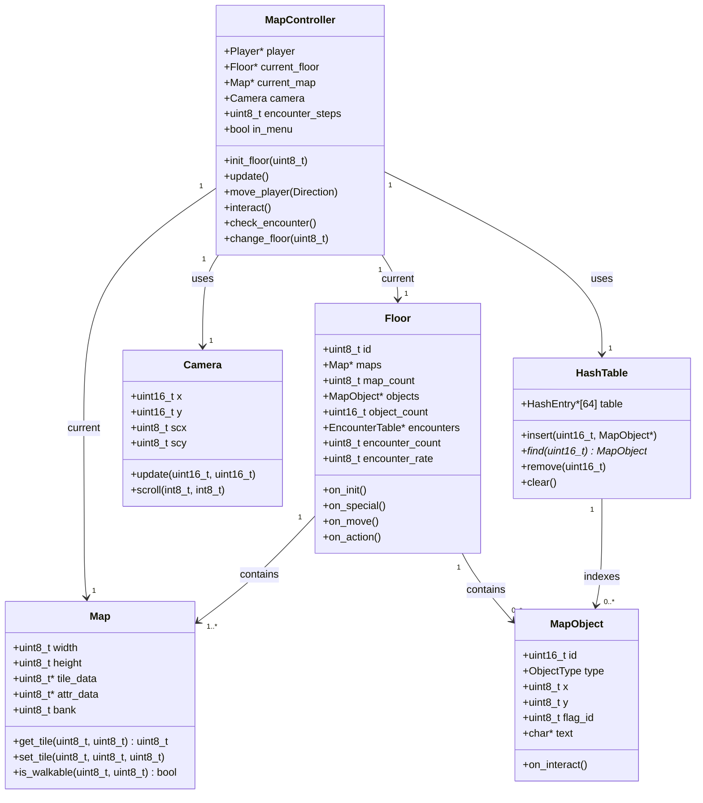
```mermaid
classDiagram
    class MapController {
        +Player* player
        +Floor* current_floor
        +Map* current_map
        +Camera camera
        +uint8_t encounter_steps
        +bool in_menu
        +init_floor(uint8_t)
        +update()
        +move_player(Direction)
        +interact()
        +check_encounter()
        +change_floor(uint8_t)
    }

    class Floor {
        +uint8_t id
        +Map* maps
        +uint8_t map_count
        +MapObject* objects
        +uint16_t object_count
        +EncounterTable* encounters
        +uint8_t encounter_count
        +uint8_t encounter_rate
        +on_init()
        +on_special()
        +on_move()
        +on_action()
    }

    class Map {
        +uint8_t width
        +uint8_t height
        +uint8_t* tile_data
        +uint8_t* attr_data
        +uint8_t bank
        +get_tile(uint8_t, uint8_t) uint8_t
        +set_tile(uint8_t, uint8_t, uint8_t)
        +is_walkable(uint8_t, uint8_t) bool
    }

    class MapObject {
        +uint16_t id
        +ObjectType type
        +uint8_t x
        +uint8_t y
        +uint8_t flag_id
        +char* text
        +on_interact()
    }

    class Camera {
        +uint16_t x
        +uint16_t y
        +uint8_t scx
        +uint8_t scy
        +update(uint16_t, uint16_t)
        +scroll(int8_t, int8_t)
    }

    class HashTable {
        +HashEntry*[64] table
        +insert(uint16_t, MapObject*)
        +find(uint16_t) MapObject*
        +remove(uint16_t)
        +clear()
    }

    MapController "1" --> "1" Floor : current
    MapController "1" --> "1" Map : current
    MapController "1" --> "1" Camera : uses
    Floor "1" --> "1..*" Map : contains
    Floor "1" --> "0..*" MapObject : contains
    MapController "1" --> "1" HashTable : uses
    HashTable "1" --> "0..*" MapObject : indexes
```

### Rendering System

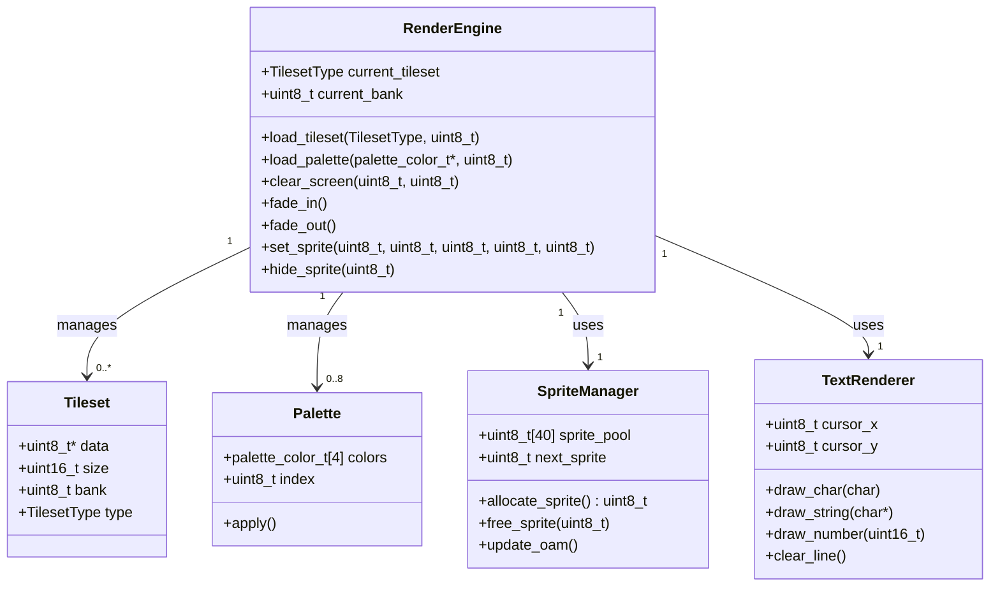
```mermaid
classDiagram
    class RenderEngine {
        +TilesetType current_tileset
        +uint8_t current_bank
        +load_tileset(TilesetType, uint8_t)
        +load_palette(palette_color_t*, uint8_t)
        +clear_screen(uint8_t, uint8_t)
        +fade_in()
        +fade_out()
        +set_sprite(uint8_t, uint8_t, uint8_t, uint8_t, uint8_t)
        +hide_sprite(uint8_t)
    }

    class Tileset {
        +uint8_t* data
        +uint16_t size
        +uint8_t bank
        +TilesetType type
    }

    class Palette {
        +palette_color_t[4] colors
        +uint8_t index
        +apply()
    }

    class SpriteManager {
        +uint8_t[40] sprite_pool
        +uint8_t next_sprite
        +allocate_sprite() uint8_t
        +free_sprite(uint8_t)
        +update_oam()
    }

    class TextRenderer {
        +uint8_t cursor_x
        +uint8_t cursor_y
        +draw_char(char)
        +draw_string(char*)
        +draw_number(uint16_t)
        +clear_line()
    }

    RenderEngine "1" --> "0..*" Tileset : manages
    RenderEngine "1" --> "0..8" Palette : manages
    RenderEngine "1" --> "1" SpriteManager : uses
    RenderEngine "1" --> "1" TextRenderer : uses
```

---

## Sequence Diagrams

### Battle Initialization

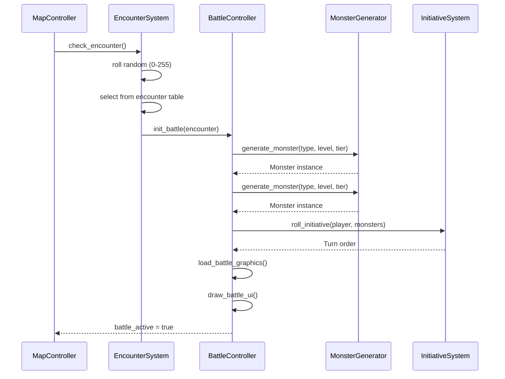
```mermaid
sequenceDiagram
    participant MC as MapController
    participant ES as EncounterSystem
    participant BC as BattleController
    participant MG as MonsterGenerator
    participant IS as InitiativeSystem

    MC->>ES: check_encounter()
    ES->>ES: roll random (0-255)
    ES->>ES: select from encounter table
    ES->>BC: init_battle(encounter)
    BC->>MG: generate_monster(type, level, tier)
    MG-->>BC: Monster instance
    BC->>MG: generate_monster(type, level, tier)
    MG-->>BC: Monster instance
    BC->>IS: roll_initiative(player, monsters)
    IS-->>BC: Turn order
    BC->>BC: load_battle_graphics()
    BC->>BC: draw_battle_ui()
    BC-->>MC: battle_active = true
```

### Player Turn

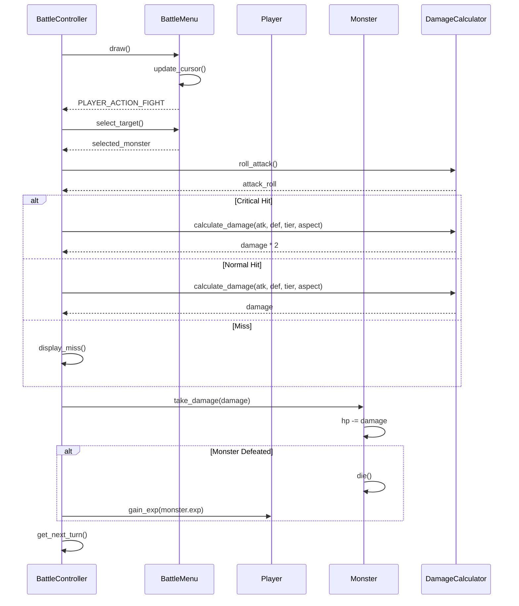
```mermaid
sequenceDiagram
    participant BC as BattleController
    participant BM as BattleMenu
    participant P as Player
    participant M as Monster
    participant DC as DamageCalculator

    BC->>BM: draw()
    BM->>BM: update_cursor()
    BM-->>BC: PLAYER_ACTION_FIGHT
    BC->>BM: select_target()
    BM-->>BC: selected_monster
    BC->>DC: roll_attack()
    DC-->>BC: attack_roll
    alt Critical Hit
        BC->>DC: calculate_damage(atk, def, tier, aspect)
        DC-->>BC: damage * 2
    else Normal Hit
        BC->>DC: calculate_damage(atk, def, tier, aspect)
        DC-->>BC: damage
    else Miss
        BC->>BC: display_miss()
    end
    BC->>M: take_damage(damage)
    M->>M: hp -= damage
    alt Monster Defeated
        M->>M: die()
        BC->>P: gain_exp(monster.exp)
    end
    BC->>BC: get_next_turn()
```

### Monster AI Turn

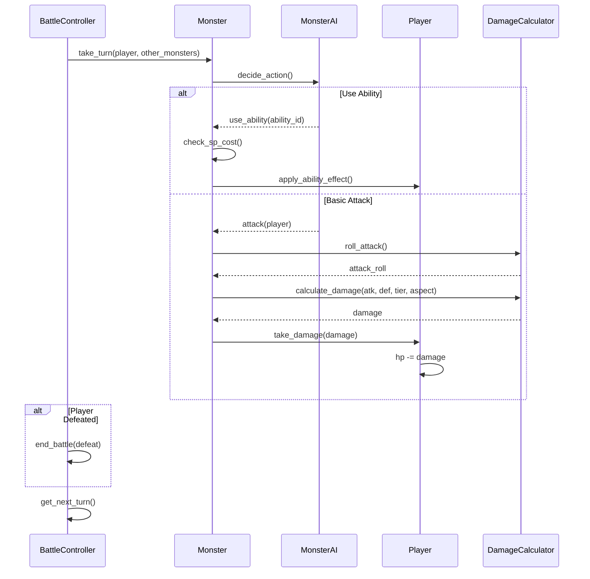
```mermaid
sequenceDiagram
    participant BC as BattleController
    participant M as Monster
    participant AI as MonsterAI
    participant P as Player
    participant DC as DamageCalculator

    BC->>M: take_turn(player, other_monsters)
    M->>AI: decide_action()
    alt Use Ability
        AI-->>M: use_ability(ability_id)
        M->>M: check_sp_cost()
        M->>P: apply_ability_effect()
    else Basic Attack
        AI-->>M: attack(player)
        M->>DC: roll_attack()
        DC-->>M: attack_roll
        M->>DC: calculate_damage(atk, def, tier, aspect)
        DC-->>M: damage
        M->>P: take_damage(damage)
        P->>P: hp -= damage
    end
    alt Player Defeated
        BC->>BC: end_battle(defeat)
    end
    BC->>BC: get_next_turn()
```

### Map Interaction

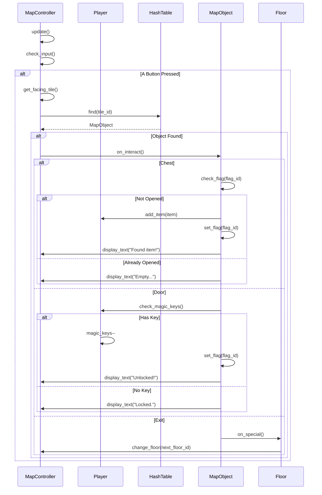
```mermaid
sequenceDiagram
    participant MC as MapController
    participant P as Player
    participant HT as HashTable
    participant MO as MapObject
    participant F as Floor

    MC->>MC: update()
    MC->>MC: check_input()
    alt A Button Pressed
        MC->>MC: get_facing_tile()
        MC->>HT: find(tile_id)
        HT-->>MC: MapObject
        alt Object Found
            MC->>MO: on_interact()
            alt Chest
                MO->>MO: check_flag(flag_id)
                alt Not Opened
                    MO->>P: add_item(item)
                    MO->>MO: set_flag(flag_id)
                    MO->>MC: display_text("Found item!")
                else Already Opened
                    MO->>MC: display_text("Empty...")
                end
            else Door
                MO->>P: check_magic_keys()
                alt Has Key
                    P->>P: magic_keys--
                    MO->>MO: set_flag(flag_id)
                    MO->>MC: display_text("Unlocked!")
                else No Key
                    MO->>MC: display_text("Locked.")
                end
            else Exit
                MO->>F: on_special()
                F->>MC: change_floor(next_floor_id)
            end
        end
    end
```

### Floor Transition

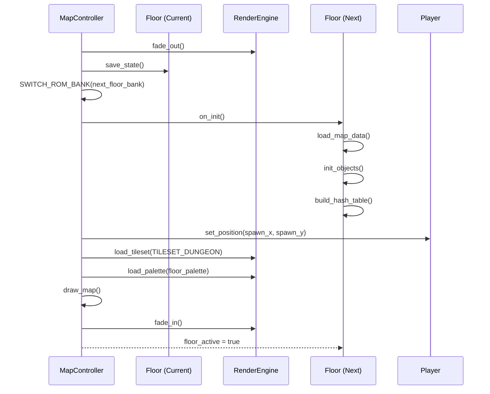
```mermaid
sequenceDiagram
    participant MC as MapController
    participant F1 as Floor (Current)
    participant RE as RenderEngine
    participant F2 as Floor (Next)
    participant P as Player

    MC->>RE: fade_out()
    MC->>F1: save_state()
    MC->>MC: SWITCH_ROM_BANK(next_floor_bank)
    MC->>F2: on_init()
    F2->>F2: load_map_data()
    F2->>F2: init_objects()
    F2->>F2: build_hash_table()
    MC->>P: set_position(spawn_x, spawn_y)
    MC->>RE: load_tileset(TILESET_DUNGEON)
    MC->>RE: load_palette(floor_palette)
    MC->>MC: draw_map()
    MC->>RE: fade_in()
    MC-->>F2: floor_active = true
```

---

## State Machine Diagrams

### Game State Machine

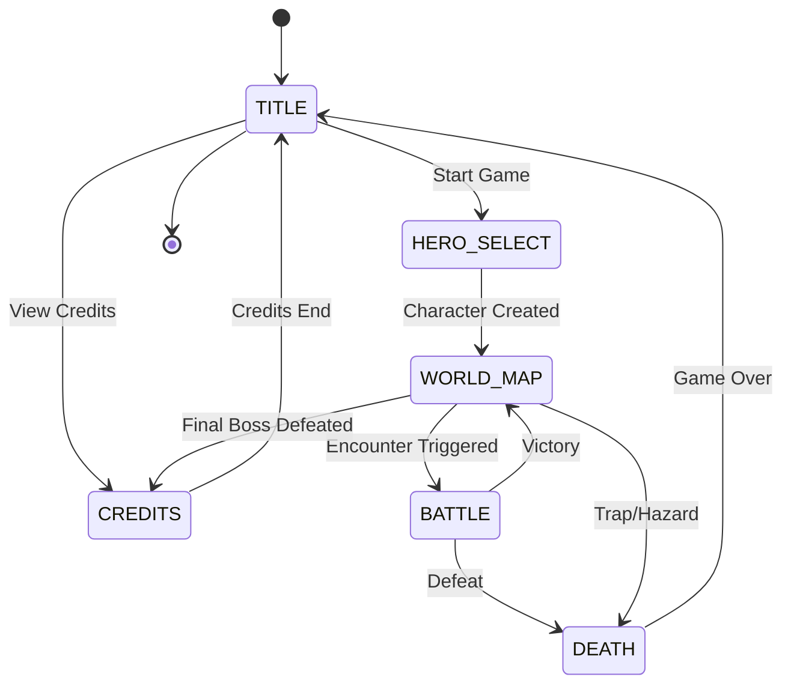
```mermaid
stateDiagram-v2
    [*] --> TITLE
    TITLE --> HERO_SELECT : Start Game
    TITLE --> CREDITS : View Credits
    HERO_SELECT --> WORLD_MAP : Character Created
    WORLD_MAP --> BATTLE : Encounter Triggered
    BATTLE --> WORLD_MAP : Victory
    BATTLE --> DEATH : Defeat
    WORLD_MAP --> DEATH : Trap/Hazard
    DEATH --> TITLE : Game Over
    WORLD_MAP --> CREDITS : Final Boss Defeated
    CREDITS --> TITLE : Credits End
    TITLE --> [*]
```

### Battle State Machine

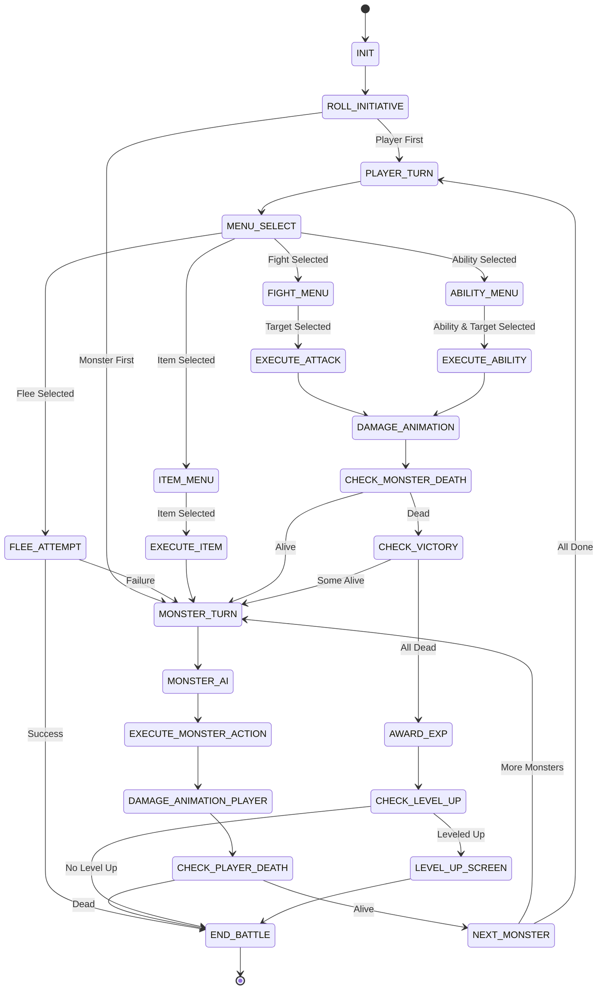
```mermaid
stateDiagram-v2
    [*] --> INIT
    INIT --> ROLL_INITIATIVE
    ROLL_INITIATIVE --> PLAYER_TURN : Player First
    ROLL_INITIATIVE --> MONSTER_TURN : Monster First
    
    PLAYER_TURN --> MENU_SELECT
    MENU_SELECT --> FIGHT_MENU : Fight Selected
    MENU_SELECT --> ABILITY_MENU : Ability Selected
    MENU_SELECT --> ITEM_MENU : Item Selected
    MENU_SELECT --> FLEE_ATTEMPT : Flee Selected
    
    FIGHT_MENU --> EXECUTE_ATTACK : Target Selected
    ABILITY_MENU --> EXECUTE_ABILITY : Ability & Target Selected
    ITEM_MENU --> EXECUTE_ITEM : Item Selected
    FLEE_ATTEMPT --> END_BATTLE : Success
    FLEE_ATTEMPT --> MONSTER_TURN : Failure
    
    EXECUTE_ATTACK --> DAMAGE_ANIMATION
    EXECUTE_ABILITY --> DAMAGE_ANIMATION
    EXECUTE_ITEM --> MONSTER_TURN
    
    DAMAGE_ANIMATION --> CHECK_MONSTER_DEATH
    CHECK_MONSTER_DEATH --> MONSTER_TURN : Alive
    CHECK_MONSTER_DEATH --> CHECK_VICTORY : Dead
    
    CHECK_VICTORY --> AWARD_EXP : All Dead
    CHECK_VICTORY --> MONSTER_TURN : Some Alive
    
    MONSTER_TURN --> MONSTER_AI
    MONSTER_AI --> EXECUTE_MONSTER_ACTION
    EXECUTE_MONSTER_ACTION --> DAMAGE_ANIMATION_PLAYER
    DAMAGE_ANIMATION_PLAYER --> CHECK_PLAYER_DEATH
    
    CHECK_PLAYER_DEATH --> NEXT_MONSTER : Alive
    CHECK_PLAYER_DEATH --> END_BATTLE : Dead
    
    NEXT_MONSTER --> MONSTER_TURN : More Monsters
    NEXT_MONSTER --> PLAYER_TURN : All Done
    
    AWARD_EXP --> CHECK_LEVEL_UP
    CHECK_LEVEL_UP --> LEVEL_UP_SCREEN : Leveled Up
    CHECK_LEVEL_UP --> END_BATTLE : No Level Up
    LEVEL_UP_SCREEN --> END_BATTLE
    
    END_BATTLE --> [*]
```

### Map Controller State

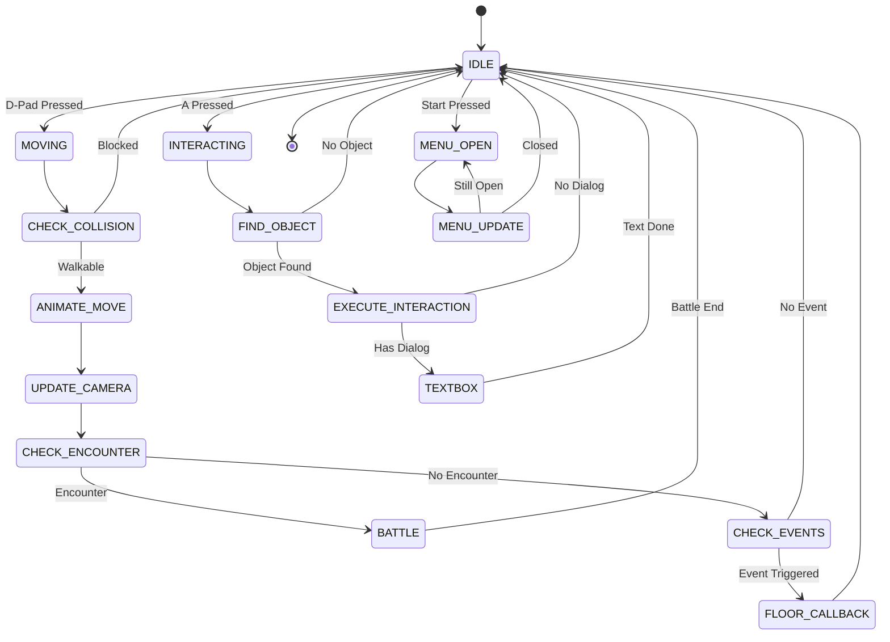
```mermaid
stateDiagram-v2
    [*] --> IDLE
    IDLE --> MOVING : D-Pad Pressed
    IDLE --> INTERACTING : A Pressed
    IDLE --> MENU_OPEN : Start Pressed
    
    MOVING --> CHECK_COLLISION
    CHECK_COLLISION --> ANIMATE_MOVE : Walkable
    CHECK_COLLISION --> IDLE : Blocked
    
    ANIMATE_MOVE --> UPDATE_CAMERA
    UPDATE_CAMERA --> CHECK_ENCOUNTER
    CHECK_ENCOUNTER --> BATTLE : Encounter
    CHECK_ENCOUNTER --> CHECK_EVENTS : No Encounter
    
    CHECK_EVENTS --> FLOOR_CALLBACK : Event Triggered
    CHECK_EVENTS --> IDLE : No Event
    FLOOR_CALLBACK --> IDLE
    
    INTERACTING --> FIND_OBJECT
    FIND_OBJECT --> EXECUTE_INTERACTION : Object Found
    FIND_OBJECT --> IDLE : No Object
    EXECUTE_INTERACTION --> TEXTBOX : Has Dialog
    EXECUTE_INTERACTION --> IDLE : No Dialog
    TEXTBOX --> IDLE : Text Done
    
    MENU_OPEN --> MENU_UPDATE
    MENU_UPDATE --> MENU_OPEN : Still Open
    MENU_UPDATE --> IDLE : Closed
    
    BATTLE --> IDLE : Battle End
    IDLE --> [*]
```

---

## Component Diagrams

### System Architecture

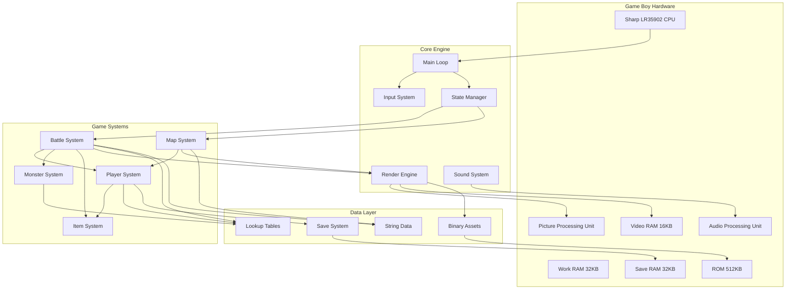
```mermaid
graph TB
    subgraph "Game Boy Hardware"
        CPU[Sharp LR35902 CPU]
        PPU[Picture Processing Unit]
        APU[Audio Processing Unit]
        VRAM[Video RAM 16KB]
        WRAM[Work RAM 32KB]
        ROM[ROM 512KB]
        SRAM[Save RAM 32KB]
    end

    subgraph "Core Engine"
        MAIN[Main Loop]
        INPUT[Input System]
        STATE[State Manager]
        RENDER[Render Engine]
        SOUND[Sound System]
    end

    subgraph "Game Systems"
        BATTLE[Battle System]
        MAP[Map System]
        PLAYER[Player System]
        MONSTER[Monster System]
        ITEM[Item System]
    end

    subgraph "Data Layer"
        TABLES[Lookup Tables]
        STRINGS[String Data]
        ASSETS[Binary Assets]
        SAVE[Save System]
    end

    CPU --> MAIN
    MAIN --> INPUT
    MAIN --> STATE
    STATE --> BATTLE
    STATE --> MAP
    BATTLE --> PLAYER
    BATTLE --> MONSTER
    BATTLE --> ITEM
    MAP --> PLAYER
    PLAYER --> ITEM
    RENDER --> PPU
    RENDER --> VRAM
    SOUND --> APU
    BATTLE --> RENDER
    MAP --> RENDER
    BATTLE --> TABLES
    MONSTER --> TABLES
    PLAYER --> TABLES
    MAP --> STRINGS
    BATTLE --> STRINGS
    SAVE --> SRAM
    PLAYER --> SAVE
    ASSETS --> ROM
    RENDER --> ASSETS
```

### Memory Layout

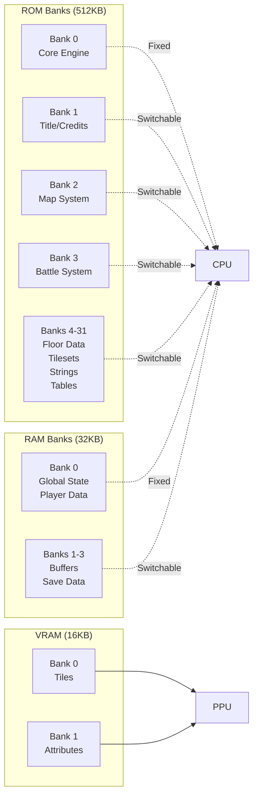
```mermaid
graph LR
    subgraph "ROM Banks (512KB)"
        B0[Bank 0<br/>Core Engine]
        B1[Bank 1<br/>Title/Credits]
        B2[Bank 2<br/>Map System]
        B3[Bank 3<br/>Battle System]
        B4_31[Banks 4-31<br/>Floor Data<br/>Tilesets<br/>Strings<br/>Tables]
    end

    subgraph "RAM Banks (32KB)"
        R0[Bank 0<br/>Global State<br/>Player Data]
        R1_3[Banks 1-3<br/>Buffers<br/>Save Data]
    end

    subgraph "VRAM (16KB)"
        V0[Bank 0<br/>Tiles]
        V1[Bank 1<br/>Attributes]
    end

    B0 -.Fixed.-> CPU
    B1 -.Switchable.-> CPU
    B2 -.Switchable.-> CPU
    B3 -.Switchable.-> CPU
    B4_31 -.Switchable.-> CPU
    
    R0 -.Fixed.-> CPU
    R1_3 -.Switchable.-> CPU
    
    V0 --> PPU
    V1 --> PPU
```

---

## Activity Diagrams

### Combat Round

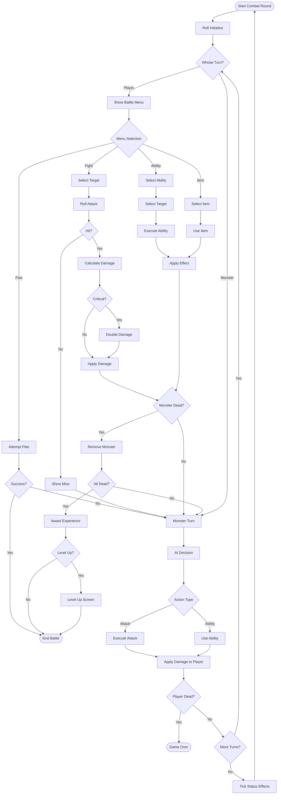
```mermaid
flowchart TD
    Start([Start Combat Round]) --> RollInit[Roll Initiative]
    RollInit --> CheckTurn{Whose Turn?}
    
    CheckTurn -->|Player| ShowMenu[Show Battle Menu]
    ShowMenu --> MenuChoice{Menu Selection}
    
    MenuChoice -->|Fight| SelectTarget1[Select Target]
    MenuChoice -->|Ability| SelectAbility[Select Ability]
    MenuChoice -->|Item| SelectItem[Select Item]
    MenuChoice -->|Flee| AttemptFlee[Attempt Flee]
    
    SelectAbility --> SelectTarget2[Select Target]
    SelectTarget1 --> RollAttack[Roll Attack]
    SelectTarget2 --> ExecuteAbility[Execute Ability]
    SelectItem --> UseItem[Use Item]
    
    AttemptFlee --> FleeCheck{Success?}
    FleeCheck -->|Yes| EndBattle([End Battle])
    FleeCheck -->|No| MonsterTurn
    
    RollAttack --> HitCheck{Hit?}
    HitCheck -->|Yes| CalcDamage[Calculate Damage]
    HitCheck -->|No| ShowMiss[Show Miss]
    
    CalcDamage --> CritCheck{Critical?}
    CritCheck -->|Yes| DoubleDamage[Double Damage]
    CritCheck -->|No| ApplyDamage[Apply Damage]
    DoubleDamage --> ApplyDamage
    
    ExecuteAbility --> ApplyEffect[Apply Effect]
    UseItem --> ApplyEffect
    ShowMiss --> MonsterTurn
    
    ApplyDamage --> CheckDeath{Monster Dead?}
    ApplyEffect --> CheckDeath
    CheckDeath -->|Yes| RemoveMonster[Remove Monster]
    CheckDeath -->|No| MonsterTurn
    
    RemoveMonster --> AllDead{All Dead?}
    AllDead -->|Yes| AwardExp[Award Experience]
    AllDead -->|No| MonsterTurn
    
    AwardExp --> CheckLevel{Level Up?}
    CheckLevel -->|Yes| LevelUp[Level Up Screen]
    CheckLevel -->|No| EndBattle
    LevelUp --> EndBattle
    
    CheckTurn -->|Monster| MonsterTurn[Monster Turn]
    MonsterTurn --> MonsterAI[AI Decision]
    MonsterAI --> MonsterAction{Action Type}
    
    MonsterAction -->|Attack| MonsterAttack[Execute Attack]
    MonsterAction -->|Ability| MonsterAbility[Use Ability]
    
    MonsterAttack --> PlayerDamage[Apply Damage to Player]
    MonsterAbility --> PlayerDamage
    
    PlayerDamage --> PlayerDead{Player Dead?}
    PlayerDead -->|Yes| GameOver([Game Over])
    PlayerDead -->|No| NextTurn{More Turns?}
    
    NextTurn -->|Yes| CheckTurn
    NextTurn -->|No| TickEffects[Tick Status Effects]
    TickEffects --> Start
```

### Map Exploration

```mermaid
flowchart TD
    Start([Player Input]) --> InputType{Input Type}
    
    InputType -->|D-Pad| GetDirection[Get Direction]
    InputType -->|A Button| GetFacingTile[Get Facing Tile]
    InputType -->|Start| OpenMenu[Open Menu]
    
    GetDirection --> CalcNewPos[Calculate New Position]
    CalcNewPos --> CheckWalkable{Tile Walkable?}
    
    CheckWalkable -->|No| PlayBump[Play Bump Sound]
    CheckWalkable -->|Yes| CheckObject{Object Blocking?}
    
    CheckObject -->|Yes| PlayBump
    CheckObject -->|No| MovePlayer[Move Player]
    
    MovePlayer --> UpdateCamera[Update Camera]
    UpdateCamera --> DrawMap[Redraw Map]
    DrawMap --> IncrementSteps[Increment Step Counter]
    
    IncrementSteps --> EncounterCheck{Random Encounter?}
    EncounterCheck -->|Yes| StartBattle[Start Battle]
    EncounterCheck -->|No| FloorCallback[Floor on_move Callback]
    
    FloorCallback --> CheckTorch{Torch Depleted?}
    CheckTorch -->|Yes| DamagePlayer[Take Damage]
    CheckTorch -->|No| End([Wait for Input])
    
    DamagePlayer --> PlayerDead{Player Dead?}
    PlayerDead -->|Yes| GameOver([Game Over])
    PlayerDead -->|No| End
    
    GetFacingTile --> FindObject[Find Object in Hash Table]
    FindObject --> ObjectFound{Object Exists?}
    
    ObjectFound -->|No| PlayError[Play Error Sound]
    ObjectFound -->|Yes| ObjectType{Object Type}
    
    ObjectType -->|Chest| CheckOpened{Already Opened?}
    ObjectType -->|Door| CheckUnlocked{Already Unlocked?}
    ObjectType -->|Lever| ToggleLever[Toggle Lever State]
    ObjectType -->|Sign| ShowText[Show Text]
    ObjectType -->|NPC| ShowDialog[Show Dialog]
    ObjectType -->|Exit| ChangeFloor[Change Floor]
    
    CheckOpened -->|Yes| ShowEmpty[Show "Empty" Text]
    CheckOpened -->|No| GiveItem[Give Item to Player]
    GiveItem --> SetFlag[Set Opened Flag]
    SetFlag --> ShowText
    
    CheckUnlocked -->|Yes| ShowUnlocked[Show "Unlocked" Text]
    CheckUnlocked -->|No| HasKey{Has Magic Key?}
    HasKey -->|Yes| UseKey[Use Magic Key]
    HasKey -->|No| ShowLocked[Show "Locked" Text]
    UseKey --> UnlockDoor[Set Unlocked Flag]
    UnlockDoor --> ShowText
    
    ToggleLever --> UpdateMap[Update Map Tiles]
    UpdateMap --> ShowText
    
    ChangeFloor --> FadeOut[Fade Out]
    FadeOut --> LoadFloor[Load New Floor]
    LoadFloor --> FadeIn[Fade In]
    FadeIn --> End
    
    ShowText --> End
    ShowDialog --> End
    ShowEmpty --> End
    ShowUnlocked --> End
    ShowLocked --> End
    PlayError --> End
    PlayBump --> End
    
    StartBattle --> BattleEnd{Battle Result}
    BattleEnd -->|Victory| End
    BattleEnd -->|Defeat| GameOver
    
    OpenMenu --> MenuLoop[Menu Update Loop]
    MenuLoop --> MenuClosed{Menu Closed?}
    MenuClosed -->|No| MenuLoop
    MenuClosed -->|Yes| End
```

---

## Deployment Diagram

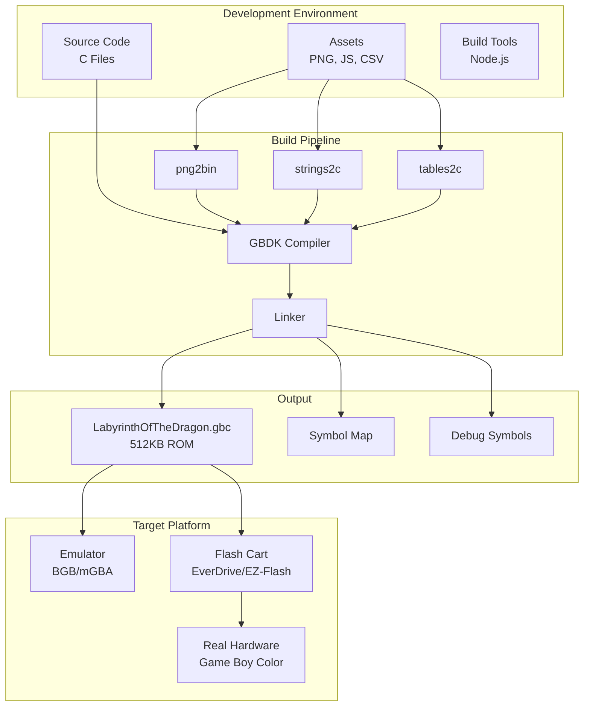
```mermaid
graph TB
    subgraph "Development Environment"
        SRC[Source Code<br/>C Files]
        ASSETS[Assets<br/>PNG, JS, CSV]
        TOOLS[Build Tools<br/>Node.js]
    end

    subgraph "Build Pipeline"
        PNG2BIN[png2bin]
        STR2C[strings2c]
        TBL2C[tables2c]
        GBDK[GBDK Compiler]
        LINKER[Linker]
    end

    subgraph "Output"
        ROM[LabyrinthOfTheDragon.gbc<br/>512KB ROM]
        MAP[Symbol Map]
        IHX[Debug Symbols]
    end

    subgraph "Target Platform"
        EMU[Emulator<br/>BGB/mGBA]
        HW[Real Hardware<br/>Game Boy Color]
        FLASH[Flash Cart<br/>EverDrive/EZ-Flash]
    end

    SRC --> GBDK
    ASSETS --> PNG2BIN
    ASSETS --> STR2C
    ASSETS --> TBL2C
    
    PNG2BIN --> GBDK
    STR2C --> GBDK
    TBL2C --> GBDK
    
    GBDK --> LINKER
    LINKER --> ROM
    LINKER --> MAP
    LINKER --> IHX
    
    ROM --> EMU
    ROM --> FLASH
    FLASH --> HW
```

---

**Document Version**: 1.0  
**Last Updated**: 2026-03-01  
**Format**: Mermaid UML
